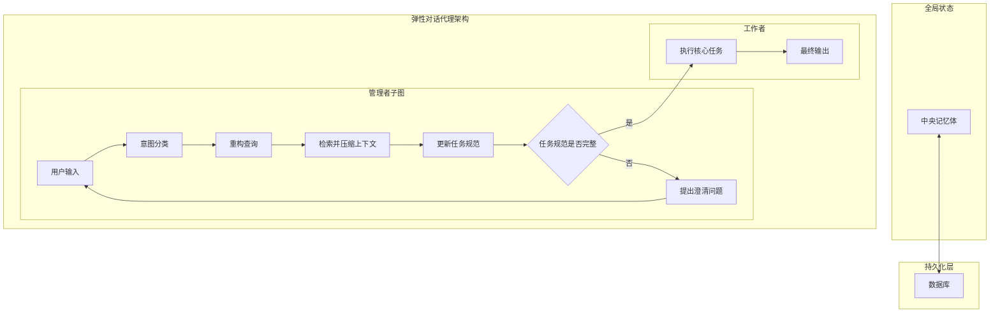

# 弹性对话代理架构图

## 架构说明

这个图表展示了一个弹性对话代理的架构设计，包含以下主要组件：

1. 架构图解读
这张图直观地展示了一个可靠的对话代理的核心工作流程：

全局状态 (Global State): 这是整个系统的“中央记忆体”。图中定义的 AgentState 包含了代理在任何时刻需要追踪的所有信息。图中的所有节点都可以读取和更新这个状态。

持久化层 (Persistence Layer): Checkpointer 负责在每一步之后将全局状态自动保存到数据库中，确保对话的持久性和容错性。

管理者子图 (Manager Sub-graph): 这是代理的“对话交互”部分，其核心是一个循环。

流程始于用户输入。

1. 意图分类: 首先判断用户的意图，决定是继续收集信息还是执行任务。

2-3. 上下文感知 RAG: 如果需要从知识库中检索信息，系统会先重构查询（使其包含上下文，更适合检索），然后检索并压缩相关文档。

4. 更新任务规范: 结合对话历史和检索到的信息，更新结构化的 task_specification。

5. 循环决策点: 这是“管理者”循环的关键。系统会检查任务规范是否已经完整。

如果否，则进入第6步，向用户提出澄清问题，然后等待下一次用户输入，从而形成一个信息收集的闭环。

如果是，则跳出循环，将控制权交给“工作者”。

工作者 (Worker): 这是代理的“任务执行”部分。

7. 执行核心任务: 它接收由“管理者”精心准备好的、干净且完整的 task_specification 和 retrieved_documents，然后调用 LLM 执行最终任务，生成最终输出。

整个流程从用户输入开始，通过意图分类、查询重构、上下文检索等步骤，最终输出结果。